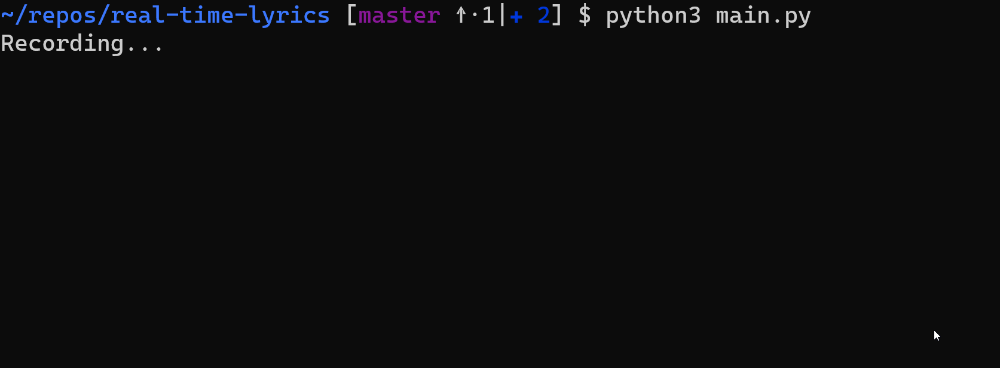
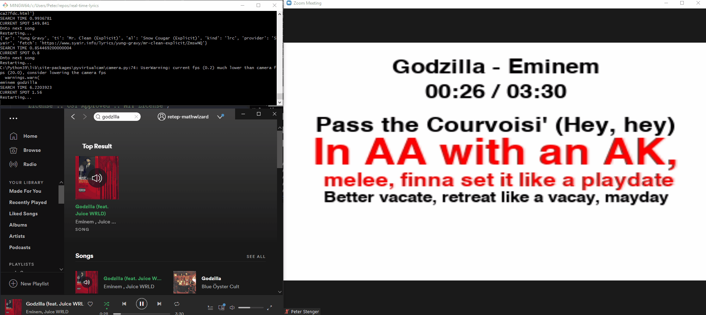

# Real time lyric detection




# Setup

```
$ python3 -m pip install -r requirements.txt
```

Set the environment variables in `.env` or elsewhere:
+ `ACR_ACCESS_KEY`
+ `ACR_ACCESS_SECRET`
+ `SPOTIFY_ID`
+ `SPOTIFY_SECRET`


Then simply

```
$ python3 acrcloud_cmdline.py
```

The program will first record audio from the microphone, then identify it using [acrcloud](https://acrcloud.com). Next the identified song is looked up on `LRC` sites

OR

```
$ python3 lyrics_spotify_camera.py
```

This program will find the spotify playing song, and create a camera using OBS-Camera with lyrics.

### Current bugs with acrcloud_cmdline

+ If you find a snippet in a chorus, the lyric timing will be off if it identifies the chorus in another part of the song instead.

+ Sampling can lead to the program searching for a very old or relatively unknown song before the main song.

+ The original swear words cannot be recovered if the word is completely starred out. E.g. `****` does not work, but `d**k` -> `dick`.

### Other quirks

The `out.wav` file and `logs/res_dump.json` are written to the current directory every record / identification cycle.